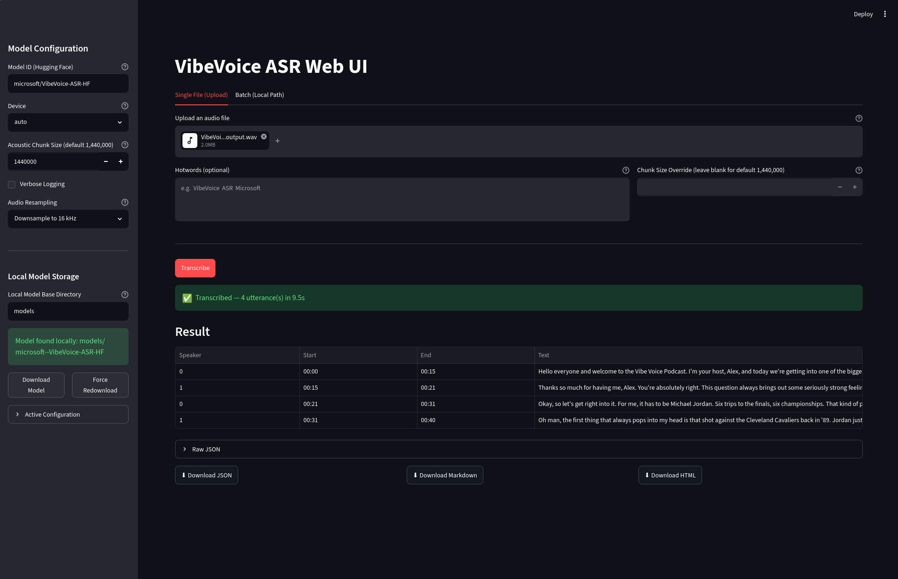

# VibeVoice ASR

Local setup for [Microsoft VibeVoice-ASR](https://github.com/microsoft/VibeVoice), a unified speech-to-text model that handles up to 60 minutes of long-form audio in a single pass, producing structured transcriptions with speaker diarization (Who), timestamps (When), and content (What).

---



---

## Overview

| Feature | Detail |
|---|---|
| **Model** | [microsoft/VibeVoice-ASR-HF](https://huggingface.co/microsoft/VibeVoice-ASR-HF) |
| **Max audio length** | ~60 minutes per pass |
| **Languages** | 50+ languages, native code-switching |
| **Output format** | Structured JSON (speaker, timestamp, content) |
| **Hotwords** | Custom prompt-based guidance |
| **Audio formats** | wav, mp3, flac, ogg, m4a, aac, wma |
| **License** | MIT |

## Requirements

- **OS**: 
  - Linux
    - (Red Hat/Fedora-family - `setup.sh` uses `dnf` for system packages)
    - (Debian/Ubuntu-family — `setup.sh` uses `apt` for system packages)
- **Python**: 3.12 (preferred, falls back to any Python 3.x if not found)
- **GPU**: AMD GPU with ROCm or NVIDIA GPU with CUDA — auto-detected by `setup.sh`. CPU fallback supported.
- **System packages**: `python3-virtualenv`, `build-essential`/`development-tools`, `python3-dev`/`python3-devel`, `pciutils` (installed automatically by `setup.sh`; exact package names vary by distro)

## Quick Start

### 1. Setup (one-time)

```bash
bash setup.sh
```

This auto-detects your GPU (AMD ROCm, NVIDIA CUDA, or CPU fallback), creates a virtual environment (`venv/`), installs the matching PyTorch build, and all required Python packages (`transformers`, `accelerate`, `librosa`, `streamlit`, etc.). No manual hardware configuration is needed.

### 2. Verify GPU

```bash
source venv/bin/activate
python torch_cuda_avail.py
```

### 3. Run

Choose one of the three interfaces:

| Interface | Command | Description |
|---|---|---|
| **Web UI** | `bash start.sh` | Streamlit web app with file upload, model config, local storage, and export |
| **CLI** | `python vibevoice.py <input> <output_dir> [--hotwords "…"]` | Batch transcribe audio files/directories to JSON |
| **Script** | `python transcribe.py` | Single-file demo transcription (edit `audio_path` in script) |

## CLI Usage

```bash
# Single audio file
python vibevoice.py audio/my_recording.wav output/

# Entire directory (recursive)
python vibevoice.py audio/ output/ --verbose

# With hotwords
python vibevoice.py audio/meeting.wav output/ --hotwords "VibeVoice,ASR,transformer"

# Reduce GPU memory pressure
python vibevoice.py audio/long.wav output/ --acoustic-chunk-size 640000

# Non-recursive
python vibevoice.py audio/ output/ --no-recursive

# Force CPU
python vibevoice.py audio/file.wav output/ --device cpu

# Use local model cache (download once, reuse)
python vibevoice.py audio/ output/ --local-model-dir models
```

### CLI Arguments

| Argument | Type | Default | Description |
|---|---|---|---|
| `input_path` | path | — | Audio file or directory |
| `output_dir` | path | — | Where JSON results are saved |
| `--hotwords` | string | *none* | Custom terms to guide transcription |
| `--acoustic-chunk-size` | int | 1,440,000 | Tokenizer chunk size (multiple of 3200); lower = less GPU memory |
| `--no-recursive` | flag | — | Don't search subdirectories |
| `--verbose` / `-v` | flag | — | Enable INFO-level logging |
| `--model` | string | `microsoft/VibeVoice-ASR-HF` | Hugging Face model ID |
| `--device` | `cuda` \| `cpu` | *auto* | Force device selection |
| `--local-model-dir` | path | *none* | Base directory for local model storage. Model is loaded from here first; downloaded from HF only if not found locally. E.g. `models/` stores at `models/microsoft--VibeVoice-ASR-HF/`. |

## Output Format

Each transcribed file produces a JSON file with the same stem in the output directory:

```json
{
  "source_file": "/absolute/path/to/audio.wav",
  "transcription": [
    {
      "Speaker": "speaker_1",
      "Start": 0.0,
      "End": 3.5,
      "Content": "Hello, welcome to the meeting."
    },
    {
      "Speaker": "speaker_2",
      "Start": 3.5,
      "End": 7.2,
      "Content": "Thanks for having me."
    }
  ]
}
```

## Project Structure

```
vibevoice_asr/
├── vibevoice.py           # Core transcription engine (VibeVoiceCore) + CLI
├── transcribe.py          # Single-file demo script
├── torch_cuda_avail.py    # GPU availability check
├── setup.sh               # Auto-detecting, one-shot environment setup
├── start.sh               # Pre-flight checks + Streamlit launcher
├── setup_steps.md         # Manual setup reference
├── requirements.txt       # Pinned Python dependencies
├── run_tests.sh           # Test runner (venv activation + pytest)
├── pytest.ini             # Pytest configuration
├── webui/
│   ├── __init__.py
│   └── app.py             # Streamlit web interface
├── tests/                 # Unit and integration tests
│   ├── conftest.py        # Shared fixtures (mocked model, audio, etc.)
│   ├── test_cli.py
│   ├── test_constants.py
│   ├── test_core_init.py
│   ├── test_discover_audio_files.py
│   ├── test_resample.py
│   ├── test_select_chunk_size.py
│   └── test_webui_helpers.py
├── models/                # Local model cache (gitignored)
│   └── microsoft--VibeVoice-ASR-HF/
├── audio/                 # Sample audio files (gitignored)
└── venv/                  # Python virtual environment (gitignored)
```

## Web UI

The Streamlit app provides a full-featured interface for transcription. Launch with `bash start.sh` (handles venv activation and dependency checks automatically).

### File Upload & Batch Processing

The app provides two tabs for transcription:

**Tab 1 — Single File (Upload):**
- **Drag-and-drop or file picker** upload of audio files (WAV, MP3, FLAC, OGG, M4A, AAC, WMA)
- **Hotwords** text area to guide transcription for the current file
- **Chunk Size Override** — per-transcription override of the acoustic chunk size (defaults to sidebar value). Useful when a single upload needs different GPU memory handling than the global config.

**Tab 2 — Batch (Local Path):**
- Transcribes audio files from **server-side filesystem paths** (useful for local Streamlit or container with mounted volumes)
- **Input Path** — path to a single audio file or directory containing audio files
- **Output Directory** — where JSON results are saved on the server
- **Recursive Search** toggle — search subdirectories when input is a directory
- **Chunk Size Override** and **Hotwords** applied across the entire batch
- Results display as expandable panels (one per file), each with its own utterance table and individual download buttons for JSON, Markdown, and HTML

### Model Configuration Panel

All model settings are in the sidebar. The model auto-reloads when any setting changes, with GPU/CPU memory freed before loading the new configuration:

| Setting | Description |
|---|---|
| **Model ID** | Hugging Face repository (default: `microsoft/VibeVoice-ASR-HF`) |
| **Device** | Auto / CUDA / CPU — auto uses CUDA if available, otherwise falls back to CPU |
| **Acoustic Chunk Size** | Must be a multiple of 3200; lower values reduce GPU memory at the cost of extra boundaries |
| **Verbose Logging** | Enables INFO-level logging for debugging |

### Audio Resampling

The sidebar includes a resampling mode selector. Downsampling reduces data volume and processing time for high-sample-rate audio (e.g., 48 kHz recordings). The VibeVoice model is optimized for 24 kHz — default is **Downsample to 16 kHz**:

| Mode | Behavior |
|---|---|
| Keep original | No resampling |
| Downsample to 24 kHz | Resample only if sample rate > 24 kHz |
| Downsample to 32 kHz | Resample only if sample rate > 32 kHz |
| Downsample to 16 kHz | Resample only if sample rate > 16 kHz |

### Local Model Storage

Manage the local model cache directly from the sidebar:

- **Local Model Base Directory** — path where models are cached (default: `models/`)
- **Model availability indicator** — shows whether the model is already downloaded locally or will be fetched on first use
- **Download Model button** — downloads the model to the local directory without loading it into memory
- **Force Redownload button** — removes the existing local copy and re-downloads

### Export Formats

Transcription results can be exported in three formats:

| Format | Description |
|---|---|
| **JSON** | Structured output with `source_file` and `transcription` array — suitable for programmatic processing |
| **Markdown** | Styled GFM table with source filename and generation timestamp — readable and editable |
| **HTML** | Standalone, self-contained HTML page with embedded CSS and a styled responsive table |

### Active Configuration

An expandable "Active Configuration" panel shows the current running configuration as JSON for quick reference.

## How It Works

### Model Reuse & Memory Management

The `VibeVoiceCore` class uses a **class-level singleton pattern** for the model. The heavy model and processor are shared across all instances via a class-level reference with a counter tracking how many live instances depend on it. This means:

- The model is loaded only once, even if multiple `VibeVoiceCore` instances are created
- When you reload the web UI page or change the configuration, the previous model is unloaded (freeing GPU/CPU memory) before the new one loads
- On the CLI side, a single process holds the model in memory for batch processing
- The model uses **float16 precision on CUDA** and **float32 on CPU**, reducing VRAM usage by roughly half compared to full float32 inference

### Local-First Loading Strategy

When `--local-model-dir` is set (or configured via the Web UI sidebar), the model uses a three-tier loading strategy:

1. **Load from local** — if the model already exists at `{local_model_dir}/{model_id with '--' instead of '/'}`, it loads directly
2. **Download to local, then load** — if `local_model_dir` is set but the model isn't present, it downloads from Hugging Face into that directory first
3. **Standard HF loading (fallback)** — if no local directory is configured or both above fail, it streams directly from Hugging Face

This makes repeated transcriptions fast (no re-download) and enables offline use once the model is cached locally.

### Automatic Chunk Sizing for Short Audio

For audio shorter than 10 minutes at 24 kHz, the internal `_select_chunk_size()` method automatically scales the acoustic tokenizer chunk size down proportionally (minimum 10 seconds), reducing memory overhead without affecting quality. The default maximum of 60 seconds is used for longer audio.

## Testing

The project includes a test suite based on [pytest](https://docs.pytest.org/). Tests are configured in `pytest.ini` and use shared fixtures defined in `tests/conftest.py` (mocked model, processor, synthetic audio files).

### Running Tests

```bash
# Activate venv and run all tests
bash run_tests.sh

# Or directly with pytest
source venv/bin/activate && pytest -v

# Run a specific test module
python -m pytest tests/test_cli.py -v

# Show reasons for skipped tests
python -m pytest --reason
```

### Test Coverage

| Module | What it Tests |
|---|---|
| `test_cli.py` | CLI argument parsing and validation |
| `test_constants.py` | Audio extensions, hop length, chunk size defaults |
| `test_core_init.py` | VibeVoiceCore initialization and class-level model sharing |
| `test_discover_audio_files.py` | File discovery by extension (recursive / non-recursive) |
| `test_resample.py` | Audio resampling modes and sample-rate detection |
| `test_select_chunk_size.py` | Automatic chunk size selection based on audio duration |
| `test_webui_helpers.py` | Markdown/HTML generation, time formatting, pipe escaping |

## Hardware Setup Notes

`setup.sh` **auto-detects** your GPU and installs the correct PyTorch build — manual configuration is rarely needed. It checks via `lspci` (AMD) or `nvidia-smi` (NVIDIA) and selects the appropriate wheel automatically. For NVIDIA, it even picks the CUDA version based on your driver:

| Driver Version | Selected CUDA Wheel |
|---|---|
| ≥ 550.54 | `cu128` |
| ≥ 525.60 | `cu126` |
| ≥ 450.80 | `cu118` |

If you ever need to override this manually, edit the PyTorch install command in `setup.sh`:

```bash
# NVIDIA GPU (CUDA) — example for cu126
pip install torch torchvision torchaudio --index-url https://download.pytorch.org/whl/cu126

# AMD GPU (ROCm 7.2)
pip install torch torchvision torchaudio --index-url https://download.pytorch.org/whl/rocm7.2

# CPU only
pip install torch torchvision torchaudio --index-url https://download.pytorch.org/whl/cpu
```

## References

- [GitHub — microsoft/VibeVoice](https://github.com/microsoft/VibeVoice)
- [Hugging Face — microsoft/VibeVoice-ASR-HF](https://huggingface.co/microsoft/VibeVoice-ASR-HF)
- [Hugging Face — microsoft/VibeVoice-ASR](https://huggingface.co/microsoft/VibeVoice-ASR)
- [VibeVoice-ASR Demo](https://huggingface.co/spaces/microsoft/VibeVoice-ASR-Demo)
- [VibeVoice-ASR Technical Report](https://github.com/microsoft/VibeVoice/tree/main/docs)
- [Finetuning Guide](https://github.com/microsoft/VibeVoice/tree/main/finetune)
- [vLLM Deployment](https://github.com/microsoft/VibeVoice/blob/main/docs/vibevoice-vllm-asr.md)
